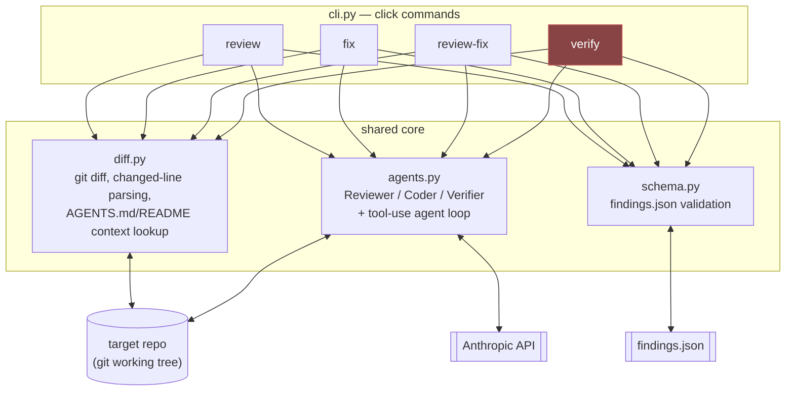
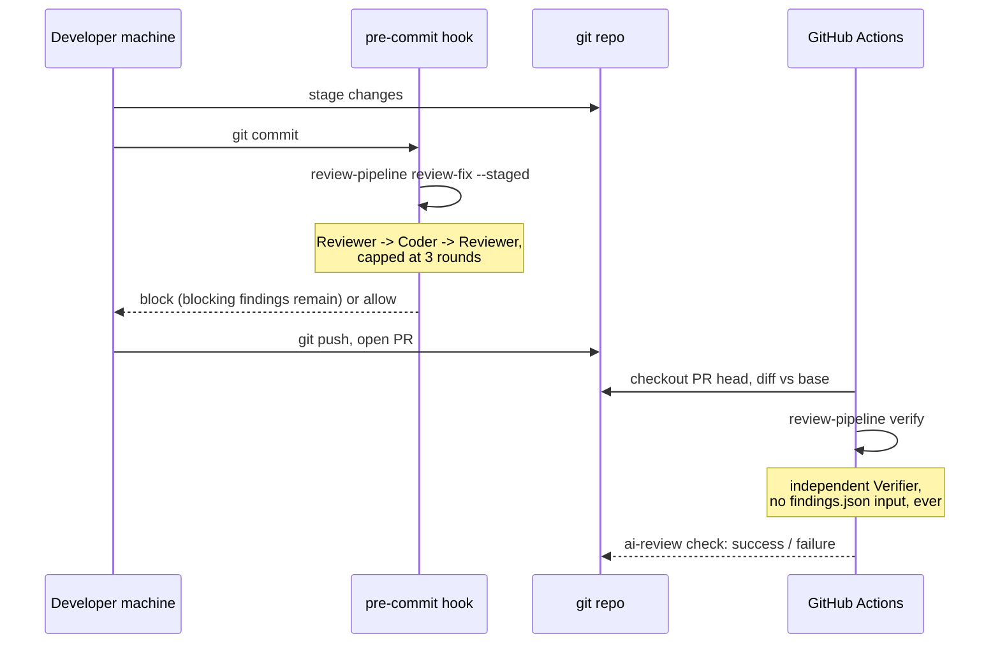
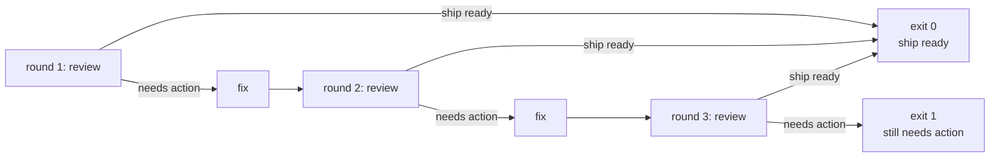

# Architecture overview

## Components

`verify` is marked out because it's the only command wired into anything
that gates a merge (see the local-vs-CI split below). All four commands sit
on the same three core modules — there's no separate code path for "the CI
version" of review logic; the isolation between round 1 and round 2 is
enforced by `verify` never being given a findings.json to read, not by
duplicating logic.

## Local round 1 vs. CI round 2

The pre-commit hook and the CI workflow never talk to each other and share
no state — the only thing they have in common is the findings.json *schema*
they both happen to produce. That's the isolation guarantee made visible as
a diagram: there is no arrow from "pre-commit hook" to "GitHub Actions" in
this picture, because there is no code path for one.

## The `review-fix` loop in detail

Each "review" box is a fresh Reviewer call against a freshly recomputed
diff — nothing carries over between rounds except what's actually on disk.

## Where each command runs

| Command | Typical caller | Writes code? | Exit code meaning |
| --- | --- | --- | --- |
| `review` | developer, CI (ad hoc) | No | non-zero if any blocking finding or `ship_ready` is false |
| `fix` | developer, `review-fix` | Yes | non-zero on error only |
| `review-fix` | pre-commit hook | Yes (via `fix`) | non-zero if action is still needed after the cap |
| `verify` | GitHub Actions only | No | non-zero if `ship_ready` is false |

Next: [how this plugs into an existing repository](05-integration.md).
